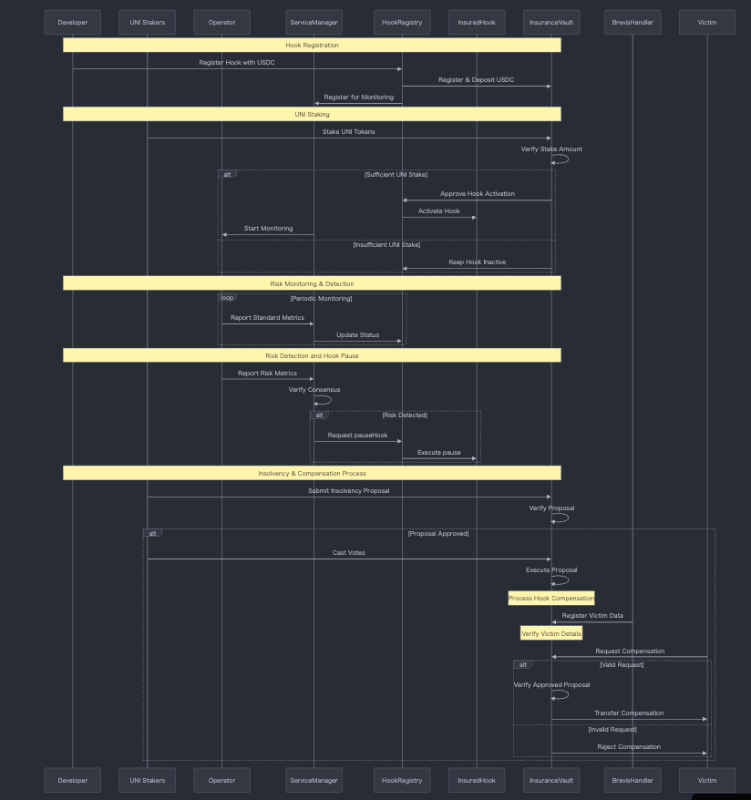

# UniGuard

Hook security monitoring Metrics-based risk detection Decentralized insurance system powered by UNI stakers Economic
security through EigenLayer

## OverView



AVS CONTRACT IS Another Repository =>
https://github.com/ZaK3939/capstone-avs/blob/main/contracts/src/UniGuardServiceManager.sol

### PROOF OF CONCEPT BY INTEGRATION TEST

This test contract suite validates the complete lifecycle of the InsuredHook system, which provides an insurance
mechanism for Uniswap V4 hooks. The system allows developers to register hooks with a deposit and UNI token holders to
stake tokens as part of the risk assessment process.

Core Components

- InsuredHook: The main hook contract that integrates with Uniswap V4
- HookRegistry: Manages hook registration and monitoring
- InsuranceVault: Handles deposits, staking, and insurance claims
- ServiceManager: Simulates the risk monitoring service

Test Scenarios

1. Hook Registration

Developers can register their hooks by providing a USDC deposit Registration requires a deposit of 10,000 USDC System
validates registration details and deposit amounts

2. UNI Token Staking

UNI token holders can stake their tokens against specific hooks Staking amount is set to 1,000 UNI per staker System
tracks staking balances and hook-specific stakes

3. Risk Monitoring and Hook Pausing

Service manager monitors hook risk levels Can update risk scores (0-100) High risk scores trigger hook pausing Paused
hooks are prevented from further operations

4. Insolvency Handling

System can create insolvency proposals for compromised hooks UNI stakers can vote on insolvency proposals Successful
proposals trigger compensation mechanisms Deposit funds are used to cover potential losses

## Set up

```
forge install
forge test
```

### Local Development (Anvil)

```bash
# start anvil, a local EVM chain
anvil

npm run build

npm run deploy:core

npm run deploy:avs

# in a new terminal
forge script script/Anvil.s.sol \
    --rpc-url http://localhost:8545 \
    --private-key 0xac0974bec39a17e36ba4a6b4d238ff944bacb478cbed5efcae784d7bf4f2ff80 \
    --via-ir --broadcast

npm run start:operator

npm run start:traffic <hookaddress>
```

npm run start:traffic 0xf04EBDe029c221173755e08B35094660b994C0c0
