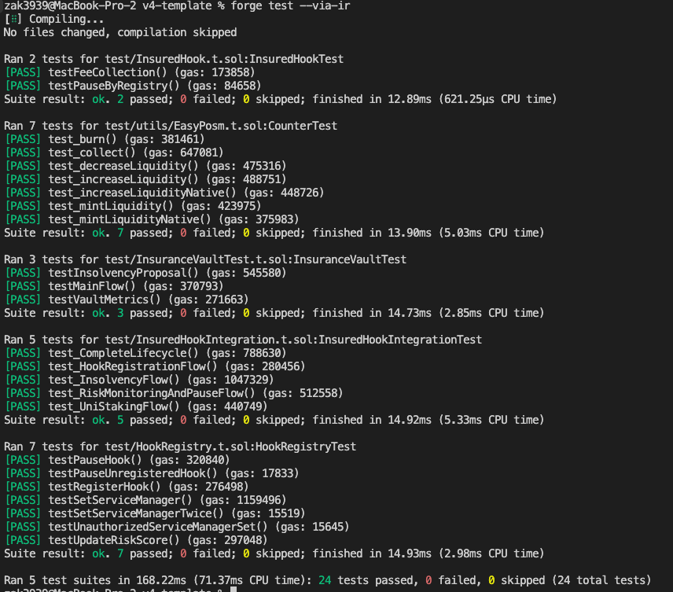

# UniGuard

UniGuard: Decentralized Insurance for Uniswap v4 Hooks

## Background

Hooks are essential for Uniswap V4's evolution - enabling custom trading logic, advanced market making, and new DeFi
primitives. But innovation must be balanced with security. This project addresses critical security needs arising from

## System


## Key Features

UniGuard implements a multi-layered security system

1. Risk Management (AVS)

- Real-time hook monitoring
- Risk score calculation
- Automated pause mechanisms

2. Decentralized Insurance (UNI + Brevis)

- UNI token staking for coverage Community-driven governance
- Transparent compensation process by Brevis

3. Economic Security

- Developer deposits in USDC
- Staker incentives Fee


### Core Components

```
A. Hook Registry

- Manages hook registration and lifecycle
- Handles USDC deposits from developers
- Controls hook activation/deactivation

B. Insurance Vault

- Manages UNI token staking and Vote
- Processes insurance claims
- Handles victim compensation

C. Service Manager (AVS)

- Monitors hook behavior
- Updates risk scores
- Triggers hook pausing
(AVS CONTRACT IS Another Repository =>
https://github.com/ZaK3939/capstone-avs/blob/main/contracts/src/UniGuardServiceManager.sol)

D. Brevis Handler (Brevis)

- Validates victim claims
- Processes compensation data
- Ensures secure claim verification

E. Insured Hook

Just a Simple UniV4 Hook
```

### PROOF OF CONCEPT BY INTEGRATION TEST

This test contract suite validates the complete lifecycle of the InsuredHook system, which provides an insurance
mechanism for Uniswap V4 hooks. The system allows developers to register hooks with a deposit and UNI token holders to
stake tokens as part of the risk assessment process.

## Core Components

- InsuredHook: The main hook contract that integrates with Uniswap V4
- HookRegistry: Manages hook registration and monitoring
- InsuranceVault: Handles deposits, staking, and insurance claims
- ServiceManager: Simulates the risk monitoring service
- BrevisHandler: Processes and verifies victim data through zero-knowledge proofs

## Test Scenarios

1. Hook Registration

   - Developers can register their hooks by providing a USDC deposit
   - Registration requires a deposit of 10,000 USDC
   - System validates registration details and deposit amounts

2. UNI Token Staking

   - UNI token holders can stake their tokens against specific hooks
   - Staking amount is set to 1,000 UNI per staker
   - System tracks staking balances and hook-specific stakes

3. Risk Monitoring and Hook Pausing

   - Service manager monitors hook risk levels
   - Can update risk scores (0-100)
   - High risk scores trigger hook pausing
   - Paused hooks are prevented from further operations

4. Insolvency and Compensation Process

   - System can create insolvency proposals for compromised hooks
   - UNI stakers can vote on insolvency proposals
   - Successful proposals unlock compensation mechanism
   - Brevis verifies victim data through zero-knowledge proofs
   - Individual victims can claim compensation after proposal approval
   - System tracks proposal status per hook using hookToProposalId
   - Compensation requires:
     - Valid victim registration through Brevis
     - Approved proposal for the corresponding hook
     - Unprocessed compensation status

5. Complete Lifecycle Testing
   - Validates the entire flow from registration to compensation
   - Tests integration between all system components
   - Verifies state transitions and access controls
   - Ensures proper event emissions at each step

#### Test



## Set up

```
forge install
forge test
```

### Local Development (Anvil)

```bash
# start anvil, a local EVM chain
anvil

npm run build

## AVS cores
npm run deploy:core

## ServiceManager
npm run deploy:avs

forge script script/Anvil.s.sol \
    --rpc-url http://localhost:8545 \
    --private-key 0xac0974bec39a17e36ba4a6b4d238ff944bacb478cbed5efcae784d7bf4f2ff80 \
    --via-ir --broadcast

```

You can also run AVS operator

```
npm run start:operator

npm run start:traffic <hookaddress>
```

npm run start:traffic 0x309F75134e9e3E901f3dF77B13cFD666EA5780c0

## Detail


